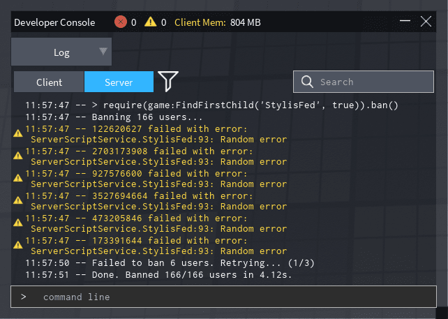

# Stylis-Fed

*Stylis-Fed* is a Roblox module designed to ban every known Stylis fed using the [Roblox Ban API](https://create.roblox.com/docs/reference/engine/classes/Players#BanAsync).

You can see the full ban list [here](https://github.com/YehaNeko/Stylis-Fed/blob/main/src/BanConfigs.luau).

## Installation

Download the [latest release](https://github.com/YehaNeko/Stylis-Fed/releases/latest) and put it inside your game.

You can also add it as a [Pesde](https://github.com/pesde-pkg/pesde) package with:

```sh
pesde add gh#YehaNeko/Stylis-Fed#main
```

## Usage

To ban users, require the module and call the `ban()` function:

```luau
require(path.to.StylisFed).ban()
```

Preferred way is to use the server console in a production server.


